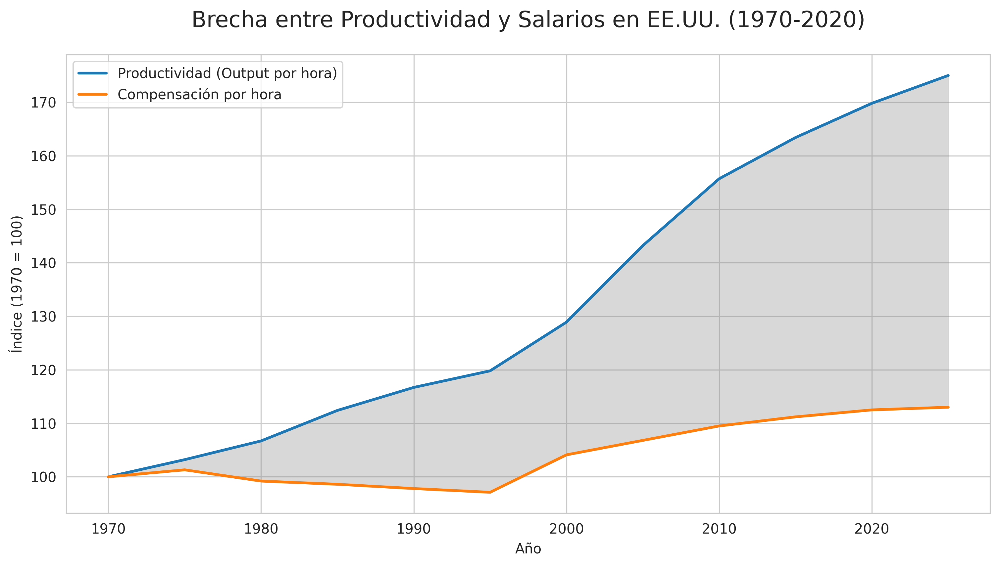

# Capítulo 1: El Financierismo y la Desconexión del Valor Real

## Introducción: El Sistema que Necesita un Enemigo
Si el financierismo tuviera un mantra, sería: *"Crea un enemigo, cualquiera servirá"*. Este capítulo expone cómo esta lógica perversa, donde el capital financiero (especulación, derivados, maximización del valor accionarial a corto plazo) domina y devora al capital productivo, ha fabricado una economía de espejismos, totalmente desconectada de la creación de valor tangible. No es solo un modelo económico fallido; es la manifestación de un sistema que necesita enemigos (crisis, inflación, mercados volátiles) para justificar su existencia y perpetuar la extracción de recursos.

**Imagine un casino donde no se juega con fichas, sino con el precio de los alimentos, la energía y la vivienda de millones de personas.** Ese casino es el financierismo: detrás de la fachada brillante del capital especulativo (apuestas financieras, derivados, obsesión por ganancias rápidas) se esconde una maquinaria que devora a la economía real, la que produce bienes tangibles, y la reemplaza por un mundo de ilusiones completamente desconectado de la producción de valor concreto. La brecha entre productividad y salarios no es un error de cálculo: es la huella dactilar de este sistema.

## 1.1. La Gran Brecha: Productividad vs. Salarios

La gráfica que abre este capítulo no es una estadística. Es la **evidencia forense de un robo a escala civilizatoria**. Desde 1970, la productividad de un trabajador estadounidense se disparó un **70%**. Su salario, en cambio, apenas gateó un **12%**. Esta brecha obscena no es un "desequilibrio del mercado". Es el diseño calculado de un nuevo orden económico: el financierismo, un sistema donde el trabajo humano es esclavizado por el capital especulativo.

El valor ya no se comparte; **se extrae**. La riqueza que el trabajador genera con sus manos y su mente no retorna a él. Queda secuestrada en un circuito parasitario de recompras accionarias, bonus para directivos y ingeniería financiera. El salario, otrora pacto social de distribución, fue degradado a mera variable de ajuste. Un costo a estrangular.

### Estados Unidos: El Golpe de Estado Corporativo

En los 80, la **Reaganomics** ejecutó el golpe. La doctrina del "*valor para el accionista*" (shareholder value) dinamitó el concepto de empresa como comunidad. La misión ya no era producir, innovar o crecer a largo plazo, sino inflar el precio de la acción a cualquier costo. Las **stock buybacks** se convirtieron en el mecanismo preferido: billones de dólares que, en lugar de invertirse en mejoras salariales o tecnología, se usaron para enriquecer a unos pocos en Wall Street. La productividad despegó; el salario, encadenado a la pista. Fue la **financiarización del alma empresarial**.

### Europa: La Austeridad como Sadismo Económico

Europa aprendió la lección con otro disfraz: el dogma de la **austeridad**. Tras el crash del 2008, la Troika (BCE, FMI, CE) no rescató a las personas; rescató a los bancos. Impuso a Grecia, España e Italia una sangría de recortes salariales y derechos laborales con la excusa perversa de "*recuperar la competitividad*". El resultado fue un continente donde la productividad se recuperaba sobre el lomo de una generación condenada a la precariedad. La riqueza no se distribuyó; se transfirió, directamente de los bolsillos de los trabajadores a las arcas de los acreedores.

### Argentina: El Paraíso del Financierismo Depredador

Pero es en **Argentina** donde el experimento alcanza su expresión más pura y brutal. El país se convirtió en el laboratorio perfecto para probar hasta qué punto un pueblo puede ser sometido en nombre de la "*libertad*" de los mercados.

En los 90, las **privatizaciones** no fueron modernización; fueron un *dumping* de activos nacionales a conglomerados que los ordeñaron hasta el tuétano, estrangulando salarios y exportando utilidades. La productividad de esos monopolios privados mejoró, sí. Pero su único propósito fue maximizar el flujo de dividendos hacia el exterior.

Hoy, bajo la presidencia anarcocapitalista de **Javier Milei**, este modelo se lleva a su conclusión lógica: el **genocidio económico**. Su retórica libertaria de "*orden espontáneo*" es la cortina de humo para una ingeniería social meticulosamente planificada a favor del capital financiero.

-   **La Megadevaluación:** No es un "*ajuste*"; es un bombardeo de artillería pesada contra el salario real, pulverizado en semanas.
-   **El Ajuste Fiscal:** No es "*saneamiento*"; es un desvío masivo de recursos: de jubilaciones, escuelas y hospitales hacia el pago puntual de una deuda externa usuraria.
-   **La Desregulación:** No es "*libertad*"; es la licencia para que oligopolios fijen precios de alimentos y energía en dólares, condenando a la población a una hiperinflación perpetua.
-   **La Guerra Cultural:** No es debate de ideas; es una estrategia para criminalizar al Estado, a los sindicatos y a los "*privilegiados*" que osan pedir un salario digno, justificando así la demolición final del contrato social.

En este infierno distópico, el trabajador argentino es forzado a una "*productividad*" surrealista: sostener tres empleos para no morir de hambre. Mientras, cada gramo de su esfuerzo extra es succionado por el sector financiero a través de tasas de interés usureras, comisiones y la fuga de capitales. La brecha no es un subproducto; es el motor del modelo. **La miseria del otro es el negocio del uno**.

### Conclusión: La Filosofía de la Escasez Fabricada

El financierismo no se contenta con explotar. Debe humillar. Su gran logro filosófico ha sido reinventar la escasez no como una limitación natural, sino como un **instrumento de control**. La narrativa de la "*meritocracia*" y la "*eficiencia*" es un arma de *gaslighting* masiva: convence al campesino que pasa hambre entre sus cultivos, al programador que no puede alquilar en la ciudad cuyo mercado inmobiliario su algoritmo optimizó, y al obrero que ensambla coches que jamás conducirá, de que su pobreza es su culpa. Que si se esfuerza un poco más, la recompensa llegará.

Pero la recompensa es un espejismo. La brecha entre productividad y salario es la prueba. Es la **huella dactilar de un sistema caníbal** que se alimenta de la promesa incumplida. Producimos abundancia como nunca en la historia, pero vivimos en la ansiedad perpetua de la carencia. Esta es la paradoja terminal, la lógica perversa que convierte el progreso humano en su propia negación.

# 1.2. Los Mecanismos del Desacoplamiento: La Máquina de Fabricar Enemigos

El financierismo no es una teoría económica. Es una **máquina de guerra**. Una ingeniería social de alta precisión cuyo producto final no es una commodity, sino la **desvinculación sistemática entre esfuerzo y recompensa**. Esta máquina no opera en el vacío: requiere de un relato tóxico que justifique su saqueo. Su combustible principal: la fabricación de chivos expiatorios.

## 1. La Maximización del Valor Accionarial: El Golpe Interno

La maximización del "valor para el accionista" fue el **caballo de Troya** que permitió el secuestro de la empresa productiva. Bajo este dogma, la compañía deja de ser una comunidad de creación para mutar en un vehículo de especulación. Invertir en I+D, salarios o sostenibilidad se tacha de "ineficiencia sentimental". La verdadera "eficiencia" es el **canibalismo financiero**: desviar cada centavo de la producción hacia las recompras de acciones (*stock buybacks*).

**El dato que lo desvela todo:** en 2022, el S&P 500 dedicó **más de 900.000 millones de dólares** a inflar artificialmente sus cotizaciones. **Apple, la empresa más valiosa del mundo, destinó más de 100 mil millones de dólares a recompras en la última década, mientras precarizaba sus cadenas de suministro en China y evadía impuestos mediante paraísos fiscales.** Ese dinero no surgió de la nada: fue **extraído**. Fue salario negado, investigación cancelada, capacidad productiva futura sacrificada en el altar del cortoplacismo.

Y aquí emerge el primer enemigo fabricado: **el trabajador que exige su parte.** La narrativa corporativa lo pinta como una "carga" que pone en riesgo la "competitividad". La verdad es lo opuesto: es la *financiarización* la que mata la competitividad real. El trabajador no es el lastre; es la fuente de valor que el accionista parasitario se apropió. La productividad crece, pero el fruto es robado antes de que pueda madurar.

## 2. La Externalización de Costos: La Esclavitud Invisible

El segundo engranaje es la externalización: el arte de hacer desaparecer los costos humanos y ecológicos de los balances contables. Lo que para una comunidad es una tragedia (un río envenenado, un trabajador exhausto), para la máquina financiera es una mera "externalidad". Un error de contabilidad que debe ser eliminado de la ecuación.

**Esta lógica no nació en una junta corporativa; fue una política de Estado. El Memorando de Estudio de Seguridad Nacional 200 (NSSM-200) de 1974, dirigido por Henry Kissinger, lo dejó claro: el crecimiento poblacional en países en desarrollo era una "amenaza" para los recursos que EE.UU. necesitaba acceder.** La externalización no fue un accidente; fue una estrategia fríamente calculada de despojo.

Las fábricas textiles en Bangladesh, las mineras en el Congo, plataformas como Uber, Glovo y Rappi que han perfeccionado este modelo: algoritmos que optimizan la extracción de valor mientras externalizan todo riesgo a "socios repartidores" sin derechos laborales, seguros ni estabilidad. Todos son eslabones de una misma cadena de valor diseñada para que el sufrimiento sea *invisible* y *impune*. La riqueza fluye hacia arriba; la miseria y el riesgo, hacia abajo y hacia los márgenes.

Ante esta evidencia, la máquina fabrica su segundo enemigo: **el que hace visible lo invisible.** El regulador, el sindicalista, el activista climático. Son tachados de "enemigos del progreso" y de "asfixiar la innovación". Su verdadero crimen es señalar el mecanismo del robo. El financierismo necesita la oscuridad para operar. Cualquier luz que se proyecte sobre su maquinaria es un ataque a su existencia.

## 3. La Economía de la Deuda: La Prisión de la Promesa Incumplida

El mecanismo más perverso es la conversión de la escasez fabricada en un instrumento de control directo: la deuda. Cuando el salario es estrangulado hasta ser insuficiente, el sistema ofrece su "solución": pide prestado para sobrevivir. La tarjeta de crédito, el préstamo estudiantil usurario, la deuda soberana con el FMI... **En la Argentina de 2024, bajo el gobierno de Javier Milei, este mecanismo alcanza su expresión más cínica: un ajuste brutal en salud, educación y salarios se presenta como "inevitable" para pagar una deuda con el FMI, mientras se culpa al "exceso de gasto social" de décadas pasadas por la crisis.** Todos son espejismos de liquidez que ocultan cadenas de dependencia perpetua.

La deuda es el mecanismo de disciplinamiento perfecto. **Un trabajador endeudado es un trabajador obediente.** Un país endeudado es un país que aplica "ajustes" (recortes sociales) por voluntad propia, para el beneplácito de sus acreedores. El sistema crea la enfermedad y luego vende el veneno como cura.

Y así nace el tercer y más cruel enemigo fabricado: **el deudor quebrado.** Se le culpa de su "mala suerte" o su "irresponsabilidad". Se convierte el fracaso de un sistema deliberadamente diseñado para que fracases, en una falla moral personal. La máquina no solo te roba: te convence de que merecías ser robado.

## Conclusión: El Engranaje Perfecto

Estos tres mecanismos—la maximización parasitaria, la externalización depredadora y la deuda carcelaria—no operan de forma aislada. Son el **sistema operativo del financierismo**. Funcionan en conjunto para extraer valor, externalizar el costo social y, crucialmente, **producir la ilusión de que este saqueo es natural, inevitable o incluso merecido.**

La máquina no solo fabrica riqueza para unos pocos y pobreza para muchos. Fabrica la narrativa que lo sustenta: una galería de enemigos imaginarios (el trabajador holgazán, el regulador abusivo, el deudor irresponsable) para ocultar su único y verdadero propósito: la **transferencia sistemática de poder y recursos hacia la cúspide financiera.**

**El financierismo no es la lógica del crecimiento: es la lógica del sacrificio. Un templo moderno donde se inmolan salarios, vidas y territorios para que unos pocos acumulen fichas en el casino global. Y como todo templo, su fuerza no está en la piedra, sino en el mito que lo sostiene. Desmontar la máquina es, antes que nada, desmontar la fe en sus dioses falsos.**

El desacoplamiento entre productividad y salario no es un error de cálculo. Es el cálculo en sí mismo.

## 1.3. Consecuencias: La Sociedad Burbuja

Vivimos en una **sociedad burbuja**, donde la riqueza es una ilusión financiera inflada por activos (bolsa, real estate) que no reflejan valor real. Las consecuencias son profundas:

-   **Precarización laboral:** El auge de la "gig economy" (repartidores, Uber) es la normalización de la inseguridad.
-   **La crisis de 2008:** No fue una anomalía; fue un síntoma inevitable. La especulación con hipotecas tóxicas fue el resultado lógico de un sistema que privilegia el beneficio ficticio sobre la estabilidad real.
-   **El surgimiento del "enemigo interno":** Para desviar la atención, el sistema fabrica chivos expiatorios: migrantes, China, la inflación—cualquier cosa que oculte su propio fracaso estructural.

## Conclusión del Capítulo: Hacia una Lógica Post-Enemiga

El financierismo es un cadáver que aún se mueve. Su verdadero fin no llegará cuando sea "derrotado", sino cuando se vuelva obsoleto. La esperanza no está en confrontarlo en su propio juego, sino en construir fuera de sus reglas. El surgimiento de alternativas—desde la integración regional en el Sur Global hasta el computacionalismo que optimiza recursos reales—no lucha contra el sistema; lo ignora. La verdadera alquimia es transmutar la lógica del miedo en la lógica de la creación. El primer paso es nombrar al verdadero enemigo: la propia lógica que necesita enemigos para sobrevivir.